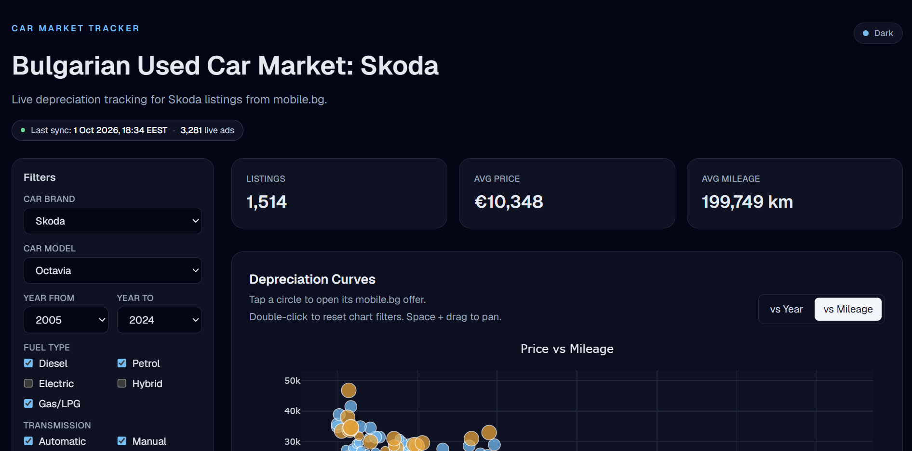
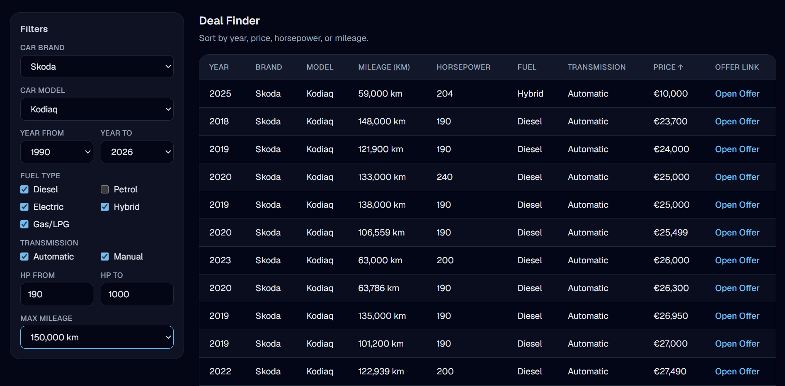
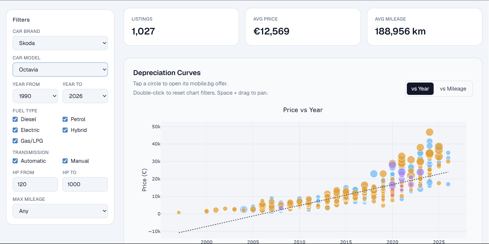
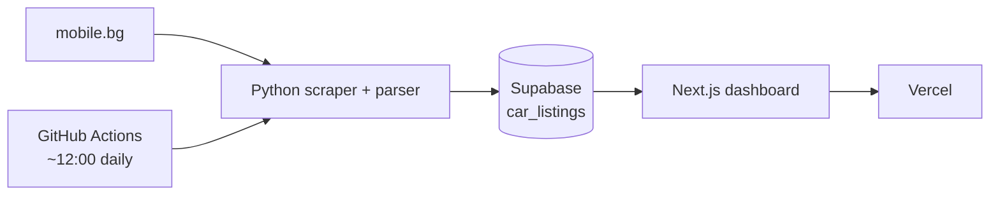

# Car Market Tracker

Live depreciation dashboard for **used Skoda cars** listed on [mobile.bg](https://www.mobile.bg).

Scrapes and cleans listings daily, stores them in Supabase, and visualizes price vs age / mileage so you can explore the Bulgarian used-car market in one place.

**Live demo:** [https://cardepreciation.vercel.app](https://cardepreciation.vercel.app)

---

## Screenshots

### Dashboard (dark)



### Deal Finder



### Light theme



---

## Features

- Interactive **Price vs Year** and **Price vs Mileage** scatter charts with trendlines
- Filters for brand, model, year, fuel, transmission, horsepower, and mileage
- **Deal Finder** table (desktop) / cards (mobile) with links to live mobile.bg offers
- Data freshness badge (last sync time + live ad count)
- Dark / light theme (dark by default)
- Responsive layout for phone and desktop
- Daily automated sync via **GitHub Actions** (no need for your PC to be on)

---

## Architecture



| Layer | Role |
|---|---|
| **Playwright scraper** | Collects Skoda search results and detail specs from mobile.bg |
| **Parser** | Keeps only trusted labeled fields; drops bad rows instead of guessing |
| **Sold check** | Removes inactive / deleted ads from the database |
| **Supabase** | Stores cleaned listings; public site reads with the anon key (SELECT only) |
| **Next.js app** (`web/`) | Dashboard UI deployed on Vercel |
| **Daily sync** | `daily_sync.py` via GitHub Actions — new ads + sold cleanup once per day |

---

## Tech stack

- **Frontend:** Next.js 15, React 19, Tailwind CSS, Plotly
- **Backend data:** Supabase (Postgres)
- **Scraper:** Python, Playwright, httpx, pandas
- **Hosting:** Vercel (web) + GitHub Actions (daily sync)

---

## Project structure

```text
car_depreciation/
├── .github/workflows/ # GitHub Actions daily sync
├── daily_sync.py      # Full / daily sync + optional Windows task installer
├── scraper.py         # mobile.bg scraping
├── parser.py          # Spec parsing / validation
├── sold_check.py      # Inactive listing detection
├── uploader.py        # Supabase upsert / delete
├── config.py
├── requirements.txt
├── .env.example
├── docs/screenshots/
└── web/               # Next.js dashboard (Vercel root directory)
```

---

## Local setup

### 1. Python scraper / sync

```bash
python -m venv venv
venv\Scripts\activate
pip install -r requirements.txt
playwright install chromium
```

Copy `.env.example` → `.env` and fill:

```env
SUPABASE_URL=
SUPABASE_ANON_KEY=
SUPABASE_SERVICE_ROLE_KEY=
```

`SUPABASE_SERVICE_ROLE_KEY` is **only** for the Python uploader. Never put it in the Next.js app or Vercel.

Useful commands:

```bash
python daily_sync.py --full          # full catalog scrape
python daily_sync.py --daily         # daily new + sold pass
python daily_sync.py --install-task --time 12:00   # optional local Windows schedule
```

### 2. GitHub Actions daily sync (recommended)

The scraper runs in the cloud so your PC does not need to be on.

1. Push this repo to GitHub (if it is not already there)
2. In the GitHub repo go to **Settings → Secrets and variables → Actions**
3. Add these repository secrets (same values as your root `.env`):
   - `SUPABASE_URL`
   - `SUPABASE_ANON_KEY`
   - `SUPABASE_SERVICE_ROLE_KEY`
4. Open the **Actions** tab → **Daily sync** → **Run workflow** once to test

The workflow (`.github/workflows/daily-sync.yml`) runs every day around **09:00 UTC** (~12:00 Bulgaria summer time). You can also trigger **daily** or **full** syncs manually from the Actions tab.

If `mobile.bg` blocks GitHub’s servers, the job will fail or scrape nothing — then a small always-on VPS is the fallback. Your Vercel site and Supabase project stay unchanged either way.

### 3. Next.js dashboard

```bash
cd web
copy .env.example .env.local
npm install
npm run dev
```

In `web/.env.local` set only the **public** keys:

```env
NEXT_PUBLIC_SUPABASE_URL=
NEXT_PUBLIC_SUPABASE_ANON_KEY=
```

Open [http://localhost:3000](http://localhost:3000).

---

## Deploy (Vercel)

1. Import this GitHub repo in Vercel
2. Set **Root Directory** to `web`
3. Add env vars:
   - `NEXT_PUBLIC_SUPABASE_URL`
   - `NEXT_PUBLIC_SUPABASE_ANON_KEY`
4. Deploy

Do **not** add the service role key to Vercel. The anon key is a public frontend key; safety comes from Supabase Row Level Security (anonymous clients can **SELECT** only).

---

## Methodology (short)

- Specs are taken from **labeled UI fields** on mobile.bg, not guessed from free text
- Incomplete / inconsistent rows are **dropped** rather than stored with wrong values
- Daily sync prefers newly posted ads (newest-first searches) and refreshes prices for seen ads
- Sold / inactive ads are removed carefully; if too many look “sold” at once, deletion is skipped to avoid wipeouts from temporary site errors

---

## Disclaimer

Personal portfolio project. Not affiliated with mobile.bg or Škoda. Listing data comes from publicly available mobile.bg pages and may change or go out of date between syncs.
